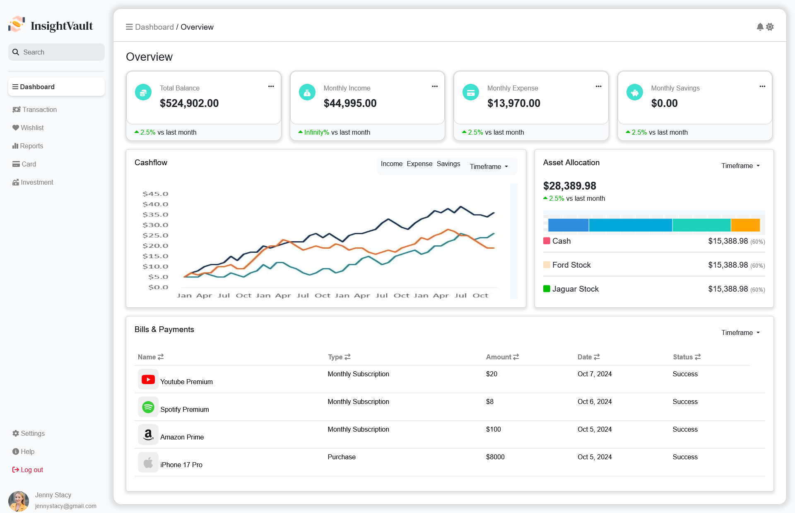
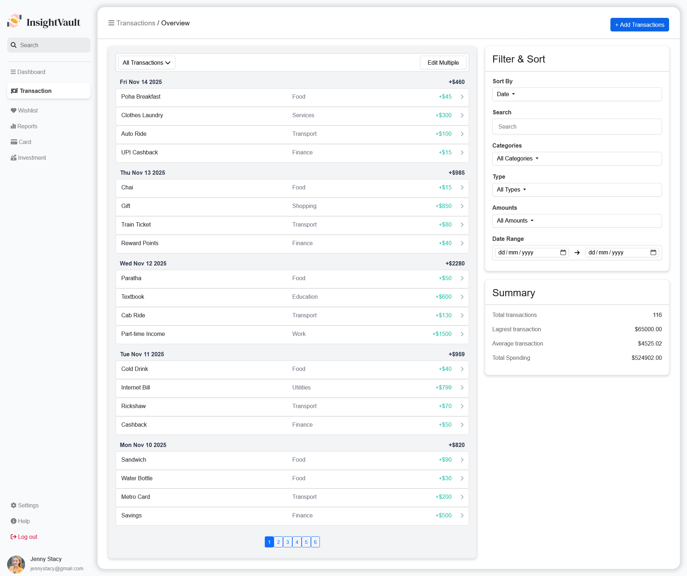
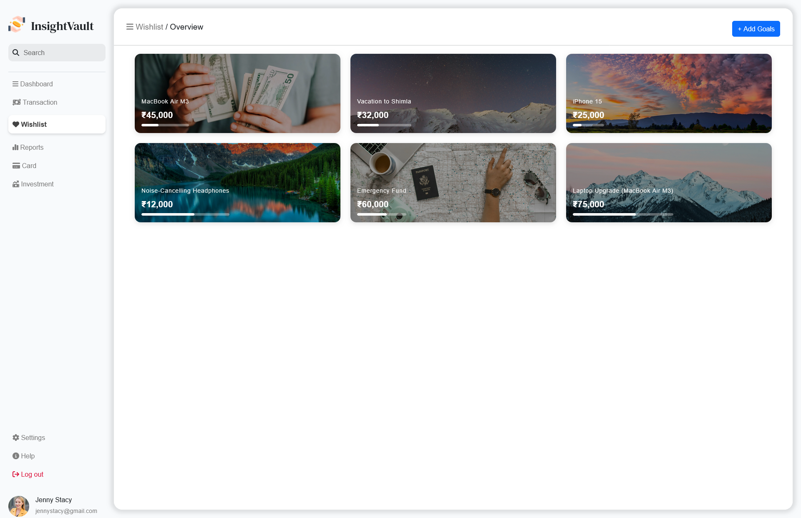
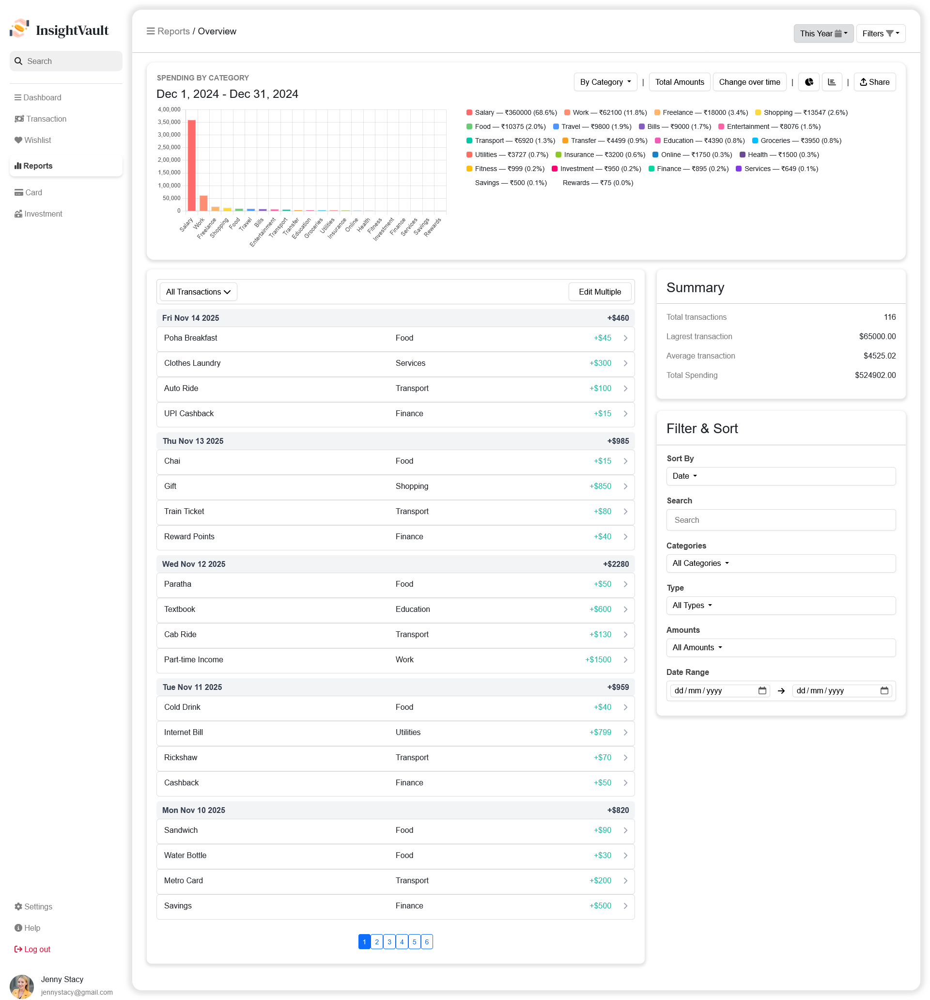

# InsightVault - Personal-Finance-Analytics-Platform

A full-stack personal finance intelligence platform for structured data management and interactive visual analytics. 
<br><br>


## Project Overview

InsightVault is a comprehensive full-stack personal finance management platform designed to empower users with the tools to track, analyze, and optimize their financial behavior. Unlike traditional expense trackers that offer static lists, InsightVault treats financial data as a dynamic asset. The platform transforms raw, unorganized transaction data into high-level intelligence through a robust client-server architecture.

By structuring data into intuitive categories and types (Income vs. Expense), the system enables deep-dive exploration. It leverages complex backend SQL aggregations to compute financial health metrics in real-time, converting these results into sophisticated visual representations. InsightVault is built to handle the complexities of a multi-user environment, offering advanced features like dynamic data filtering, server-side pagination for large datasets, and a goal-oriented wishlist system—all wrapped in a high-performance, mobile-responsive dashboard.


## Objective / Motivation

The primary motivation behind InsightVault was to strip away the "magic" of modern frontend frameworks and confront the core challenges of web engineering head-on.

* **Mastering the Fundamentals:** In an era dominated by React and Vue, I chose a "fundamentals-first" approach. This project served as a rigorous laboratory for mastering manual DOM manipulation, understanding the nuances of the browser rendering engine, and implementing complex layouts using modern **CSS Grid** and **Flexbox** without the safety net of a framework.

* **System Design & Communication:** A core focus was replicating the communication patterns used in enterprise-level applications. This involved designing a custom RESTful API from scratch and managing the intricate "Request-Response" lifecycle that occurs between a decoupled frontend and backend.

* **Data Integrity & Architecture:** I aimed to practice clean architecture principles by ensuring a strict separation of concerns. This project demonstrates my ability to build a modular system where the frontend acts purely as a presentation layer, while the backend maintains the "Source of Truth" through a secured relational database.


## ⚙️ Features

### 1. Transaction Management & Persistence
* **Full CRUD Lifecycle:** Seamlessly add, view, update, and delete financial records.
* **Detailed Schema:** Each transaction captures essential data points: Amount, Category, Type (Income/Expense), Date, and optional Descriptions.
* **Relational Persistence:** All data is strictly validated and stored in a structured SQL database (SQLite/Turso), ensuring long-term data integrity and ACID compliance.

### 2. Advanced Filtering & Data Exploration
* **Granular Filtering Engine:** A multi-dimensional system allowing users to isolate data by categories (e.g., Rent, Salary, Food), transaction types, or keyword searches.
* **Temporal Intelligence:**  Built-in date range selectors (This Week, This Month, Custom) for period-over-period financial analysis.
* **Dynamic Sorting:** Toggle between newest/oldest or highest/lowest amounts to identify spending outliers instantly.
* **Server-Side Pagination:** Optimized for large datasets; the backend serves data in chunks, keeping the UI snappy even with thousands of records.

### 3. Reports & Analytics Engine
* **Real-Time Visualizations:** Dynamic pie charts and trend graphs powered by **Chart.js** that update instantly as filters are applied.
* **Aggregated Insights:** Uses backend `GROUP BY` and `SUM SQL` logic to calculate category breakdowns and monthly totals.
* **Trend Analysis:** Visualizes income vs. expense trends over time, helping users identify seasonal spending habits.

### 4. Wishlist & Savings Goals
* **Goal Tracking:** Set targets for future purchases or savings milestones.
* **Progress Analytics:** Automatically calculates the percentage achieved based on current financial standing.
* **Interactive Progress UI:** High-visibility progress bars and goal cards that provide immediate visual gratification as users save.


### 5. Architecture & Engineering Highlights
* **Modular Frontend:** Built with ES6 modules to ensure deterministic rendering and prevent global scope pollution.
* **RESTful Communication:** A custom-built API manages the "Request-Response" lifecycle between the decoupled client and server.
* **Defensive Design:** Robust error handling and loading states ensure the app remains stable even during network interruptions or empty data states.


## System Architecture & Data Flow

InsightVault utilizes a modern, decoupled client-server architecture designed for scalability and deployment flexibility.

`Client (Vercel)` ➔ `API (Node/Express)` ➔ `Database (Turso/SQLite)`

* **Development Architecture:** In local development, the **Express server serves both the API and the static frontend files** via express.static(). This ensures a unified environment for testing core logic.
* **Production Architecture:** For deployment, the frontend is hosted separately on Vercel to leverage edge delivery, while the API remains a standalone service, reflecting enterprise-scale infrastructure.


### The Request Lifecycle
1.  **Event Capture:** The JavaScript event listener captures user input and packages the filter parameters into a URL query string.
2.  **Asynchronous Fetch:** An `async/await` fetch call is dispatched to the Express.js backend.
3.  **API Routing:** The Express router identifies the endpoint and passes the parameters to the designated Controller.
4.  **SQL Execution:** The Controller builds a dynamic SQL query, utilizing the database engine to perform sorting, filtering, and aggregating.
5.  **JSON Response:** The backend returns a structured JSON object containing the results and metadata (like total count for pagination).
6.  **DOM Update:** The frontend receives the data, clears existing UI elements, and maps the new data into the DOM.

### RESTful API Documentation

| Endpoint | Method | Params/Query | Description |
| :--- | :--- | :--- | :--- |
| `/api/transactions` | GET | `page`, `limit`, `category`, `type`, `search`, `startDate`, `endDate` | Returns paginated transactions based on active filters. |
| `/api/transactions` | POST | JSON Body | Validates and creates a new transaction record. |
| `/api/reports/totals` | GET | `startDate`, `endDate` | Aggregates income/expense totals for dashboard metrics. |
| `/api/reports/categories` | GET | `type`, `startDate`, `endDate` | Provides grouped data for pie chart visualization. |
| `/api/wishlist` | GET | - | Retrieves savings goals and computed progress. |


## 🛠️ Tech Stack

* **Frontend:** HTML5, CSS3 (Grid/Flexbox), Vanilla JavaScript (ES6+), Bootstrap 5, Chart.js.
* **Backend:** Node.js, Express.js.
* **Database:** SQLite3 (Dev), Turso/libSQL (Prod).
* **Hosting:** Vercel (Frontend), Turso (Managed Database).


## Key Design Decisions

### 1. The "Vanilla+" Choice (Why No React?)
I chose to build the frontend using HTML, CSS, and Vanilla JavaScript specifically to strengthen my core fundamentals. Before abstracting logic with frameworks, I wanted a deep mastery of:

* **Manual DOM Manipulation:** Managing the lifecycle of elements without a virtual DOM.
* **Event Architecture:** Coordinating complex user interactions and data updates across modular files.
* **State Management:** Developing custom patterns to ensure the UI remains synced with backend data.
* **Modern CSS:** Utilizing Grid and Flexbox for layouts to avoid heavy framework dependencies.
*This decision ensures that I understand the "how" and "why" behind the tools used in modern web engineering.*

### 2. Strategic Pivot to SQLite (Portability)
I opted for SQLite3 for its exceptional portability. The database is a single file within the project, meaning reviewers can clone the repo and run it instantly without complex DB setups. This file-based approach also made the migration to Turso (Cloud SQLite) seamless for production readiness.

### 3. Computation Offloading (Backend-First)
I made a conscious architectural decision to perform all data "heavy lifting" on the backend. By using SQL for grouping and summing data, I keep the frontend lightweight. This ensures the app remains fast even on lower-end mobile devices, as the client only renders final results.

### 4. Backend Architecture: RESTful & Modular
The backend is designed for scalability and maintainability by mirroring real-world enterprise systems:
* **Strict Separation of Concerns:** Clear boundaries between **Routes** (endpoints), **Controllers** (business logic), and the **Database Layer.**
* **Structured Data Flow:** APIs return consistent, structured JSON responses, allowing for a decoupled architecture where the frontend acts purely as a presentation layer.

### 5. Data Handling: Pagination & Performance Awareness
To prevent UI overload and ensure high performance with large datasets:
* **Server-Side Pagination:** Implemented logic to fetch and display data in controlled chunks.
* **Optimized Rendering:** Controls the number of active DOM elements, resulting in faster load times and a smoother user experience.

### 6. Data Visualization Strategy
Raw financial data is converted into actionable intelligence through a structured visualization pipeline:
* **Chart.js Integration:** Integrated for dynamic rendering of category distributions (Pie Charts) and temporal trends (Line Graphs).
* **Data Transformation:** Developed custom logic to transform raw SQL results into the specific data structures required by visualization libraries.

### 7. Dynamic Filtering & Query Design
A sophisticated query-building system allows for flexible, real-world reporting:
* **Multi-Parameter Filtering:** Users can drill down by date range, category, or type.
* **Reusable API Design:** The backend query engine dynamically adjusts SQL based on query parameters, ensuring the API remains dry and scalable.

### 8. Database Migration: Turso (Cloud SQLite)
Initially implemented with local SQLite for rapid prototyping, the project was migrated to Turso for production readiness:
* **Portability & Deployment:** Switching to Turso allows for a distributed cloud database that integrates seamlessly with Vercel while maintaining SQLite's lightweight compatibility.
* **Remote Accessibility:** Eliminates the dependency on local files, making the platform accessible from any location.

## Deployment & System Integration
* **Vercel Deployment:** Leverages a global edge network for static assets.
* **Turso Integration:** Transitions local file storage to a managed, edge-distributed cloud database.
* **System Simulation:** Mimics enterprise infrastructure by decoupling the presentation, logic, and data layers.


## Project Status

This project is currently in **Active Development (Beta)**.

* **Completed:** Full-stack loop, SQL aggregation logic, analytics dashboard, and core filtering engine.
* **In Progress:** Fine-tuning mobile responsiveness for complex data tables and navigation.
    * Finalizing UI/UX error boundaries and form validations.
    * Balancing financial dataset realism for more accurate visual reporting.
    * Refactoring server paths to allow execution from any terminal directory.


## Future Improvements & Roadmap

### Next-Gen Evolution (React & AI)
* **React Transformation:** Rebuilding the UI in React to implement a more sophisticated state management layer and enhanced component reusability.
* **AI Predictive Analytics:** Developing a backend service that utilizes historical data to predict future spending patterns and offer personalized financial advice.

### Security & Multi-User Support
* **User Authentication:** Implementing JWT-based authentication to support private user profiles and secure data isolation.
* **CORS & Middleware Optimization:** Refining server-side security middleware for strict cross-origin request management.

### Advanced Data Features
* **Export Functionality:** Adding the ability to export financial summaries and transaction history as formatted PDF or CSV files.
* **Extended Temporal Analysis:** Implementing "Month-over-Month" and custom-range comparisons across all reporting modules.
* **Investment & Credit Cards:** Dedicated expansion modules for managing credit card balances and tracking investment portfolios.

### UI/UX & Mobile
* **Viewport Optimization:** Adjusting fluid container logic to ensure a premium look at 100% browser zoom (fixing current 80% zoom bias).
* **Mobile App Wrapper:** Exploring the use of Capacitor to wrap the responsive web app into a native mobile experience.
* **Transaction Deep-Dives:** Adding "Expandable Details" to the transaction table for viewing advanced metadata.

### Technical Scaling
* **PostgreSQL Migration:** Transitioning to a high-concurrency relational database for enterprise-grade scalability.
* **Polished Interaction:** Removing UI artifacts (search bar focus outlines) and refining navigation active-state tracking.


## 📦 Setup Instructions

1.  **Clone the Repository:**
    ```bash
    git clone [https://github.com/Griffinn/InsightVault-demo.git](https://github.com/Griffinn/InsightVault-demo.git)
    cd InsightVault-demo
    ```
2.  **Install Dependencies:**
    ```bash
    cd backend
    npm install
    ```
3.  **Environment Configuration:** Create a `.env` file in `backend/` and add your database credentials (or rely on the local `database.sqlite` if applicable):
    ```env
    TURSO_DATABASE_URL=your_turso_database_url
    TURSO_AUTH_TOKEN=your_turso_auth_token
    ```
4.  **Run the application:**
    ```bash
    node server.js
    ```
5.  **Access the Dashboard:** Open your browser to `http://localhost:8000`


## 📂 Folder Structure

```text
├── backend/                                 Express.js Server Environment
│ ├── controllers/                           Business logic & SQL query aggregation
│ ├── routes/                                REST API endpoint definitions
│ ├── db/                                    Database connection logic (Turso/SQLite)
│ ├── middleware/                            Custom error handling & logging
│ ├── utils/                                 Helper functions for data formatting
│ └── server.js                              Main entry point for the backend server
├── frontend/                                Presentation Layer & Client Logic
│ ├── css/                                   Modern CSS Grid & Flexbox layouts
│ ├── js/                                    Modular Vanilla JS (Charts, UI modules, API logic)
│ ├── pages/                                 Semantic HTML structures for sub-pages
│ └── index.html                             Main landing dashboard / SPA Entry
├── .gitignore                               Version control exclusions
├── assets/                                  Project images, icons, and static assets

```


## Screenshots / Demo

### Desktop Dashboard

### Dashboard

*Main dashboard showing the transaction summary, quick navigation, and overall financial health at a glance.*

### Transactions

*Detailed transaction log featuring backend-driven pagination and multi-dimensional filtering by category and date.*

### Wishlist

*Savings goal tracker with interactive progress bars to visualize milestones for future purchases.*

### Reports

*Dynamic analytics engine using Chart.js to visualize spending distribution and income trends over time.*

### Analytics & Reports

*Real-time data visualization using Chart.js based on filtered SQL queries.*

### Mobile Responsiveness
| Mobile Dashboard | Transaction List |
| :---: | :---: |
|  |  |
| *Fully responsive CSS Grid layout* | *Optimized for smaller screens* |


## 🌐 Live Demo

[Explore the Live Deployment](https://insight-vault-demo.vercel.app/)


## Closing Note

InsightVault is a deep dive into full-stack architecture. By focusing on data flow and architecture over framework dependency, I’ve built a system that is robust and data-driven from the ground up.
